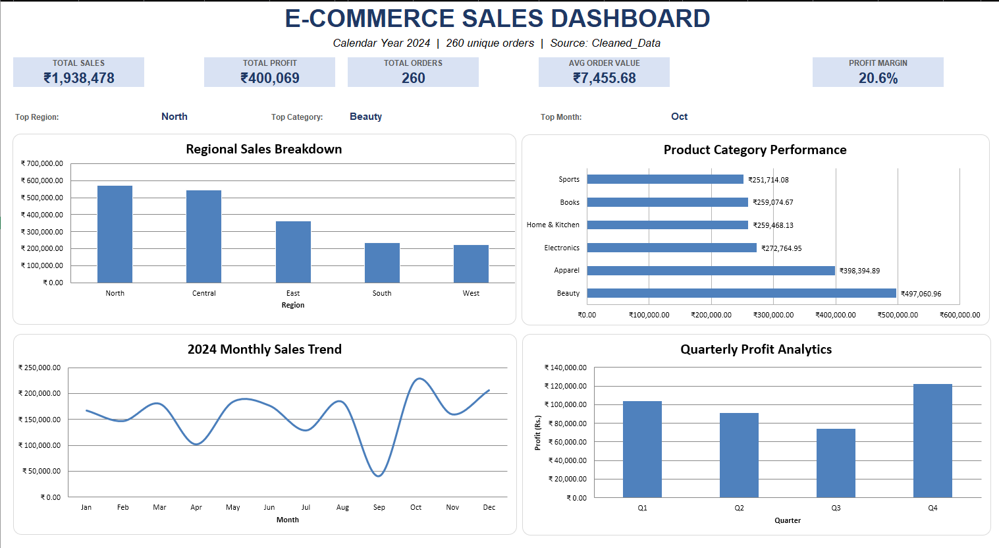
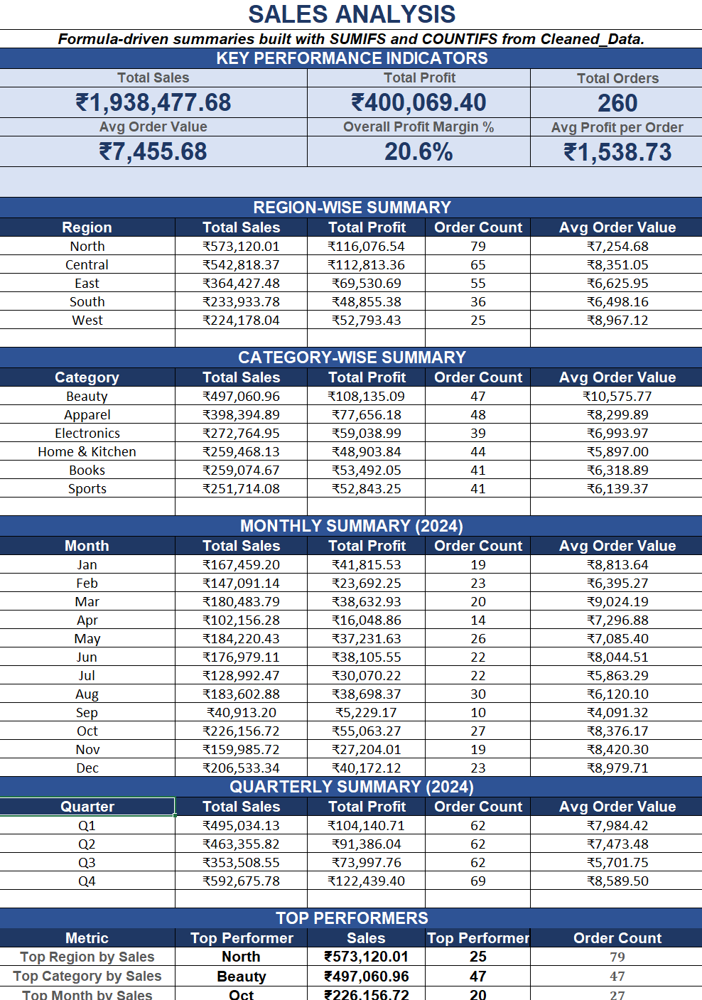
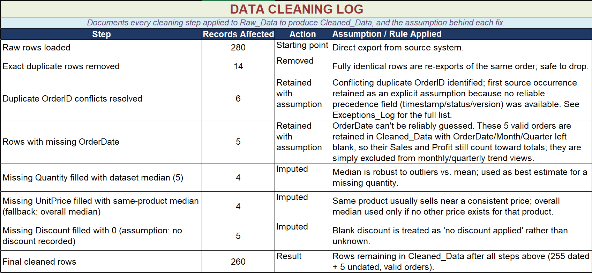

# E-Commerce Sales Analytics — Excel Dashboard

## About This Project

I built this project in Microsoft Excel to work with e-commerce order data and turn it into useful sales and profit information.

The project covers data cleaning, data preparation, KPI calculation, analysis, and dashboard creation. I used the data to understand sales performance across regions, categories, months, and quarters.

## What I Worked On

- Cleaned and prepared the raw order data
- Checked duplicate and inconsistent records
- Handled missing and invalid values
- Created calculated fields for analysis
- Calculated sales and profit KPIs
- Analyzed performance by region, category, month, and quarter
- Created an Excel dashboard to present the results

## Excel Skills Used

- Data Cleaning
- Excel Formulas
- SUMIFS
- COUNTIFS
- KPI Calculation
- Data Analysis
- Data Visualization
- Dashboard Creation

## Project Flow

Raw Data  
↓  
Data Quality Check  
↓  
Data Cleaning  
↓  
Calculated Fields  
↓  
Sales & Profit Analysis  
↓  
Dashboard

## Main KPIs

- Total Sales
- Total Profit
- Total Orders
- Average Order Value (AOV)
- Profit Margin

## Analysis Included

- Sales by Region
- Sales by Category
- Monthly Sales Trend
- Quarterly Profit
- Top Region by Sales
- Top Category by Sales
- Top Month by Sales

## Data Quality Work

The raw dataset contained duplicate records, missing values, invalid entries, and conflicting duplicate OrderIDs.

I reviewed these issues and documented the cleaning decisions instead of removing records without explanation.

Valid orders with a missing OrderDate were retained for overall sales and profit analysis, while date-based analysis uses only records with an available OrderDate.

Conflicting duplicate OrderIDs are documented separately in the Exceptions Log.

## Dashboard Preview



## Analysis Preview



## Cleaning Log Preview



## Project Structure

```text
ECommerce-Sales-Analytics-Excel/
│
├── ECommerce_Sales_Analytics_Dashboard.xlsx
├── README.md
│
├── images/
│   ├── dashboard.png
│   ├── analysis.png
│   └── cleaning_log.png
│
└── docs/
    └── ECommerce_Sales_Analytics_Case_Study_PRINT_READY.pdf
